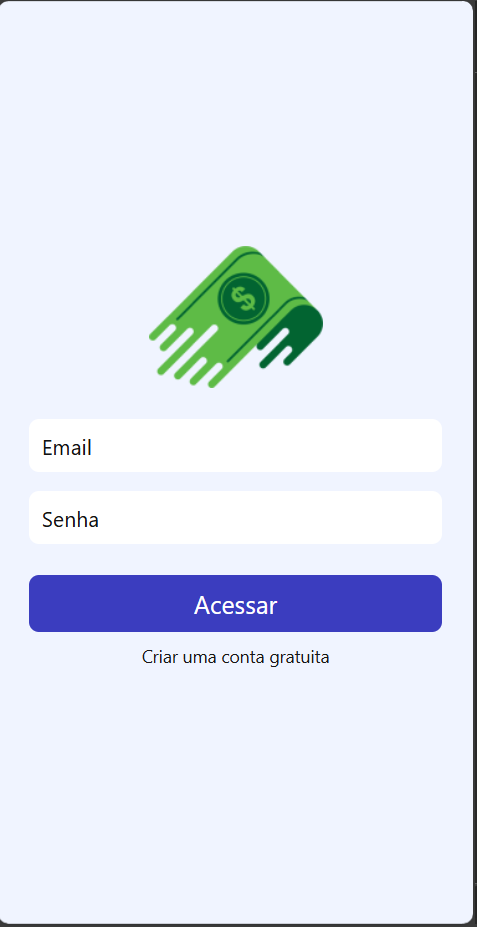
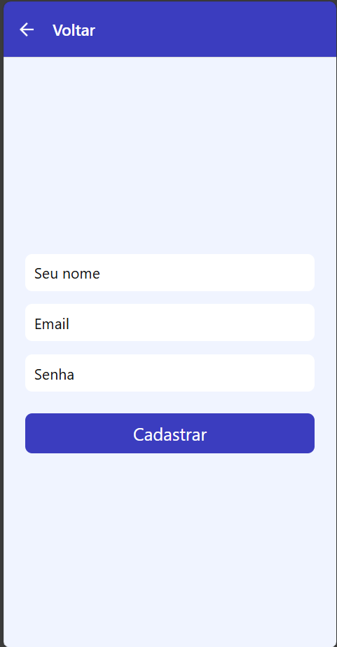
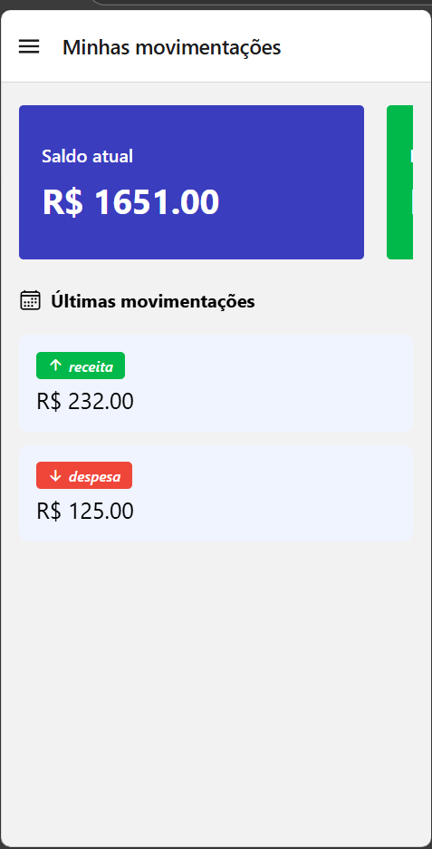
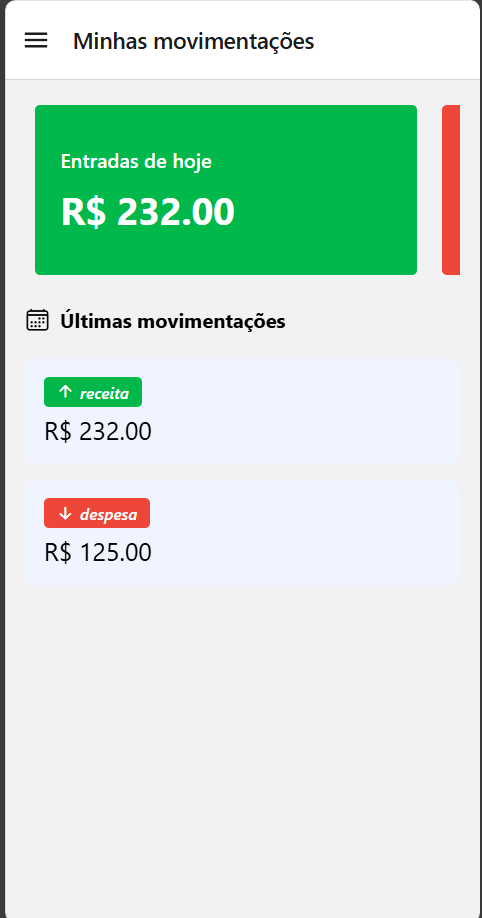
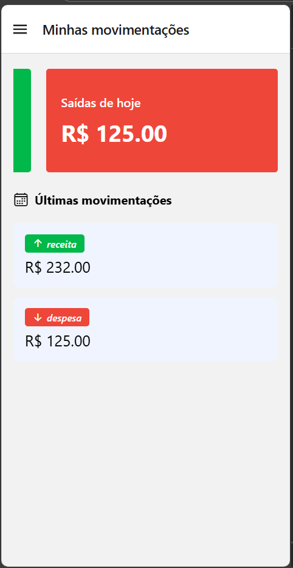
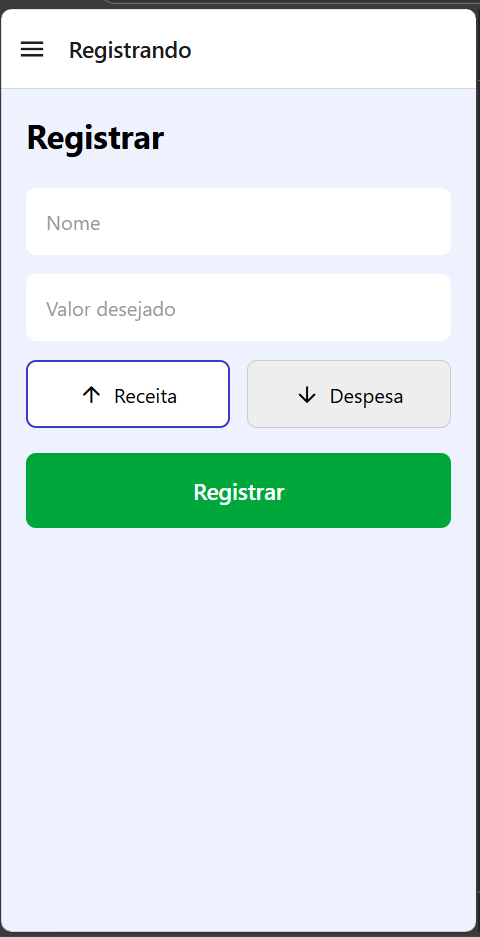
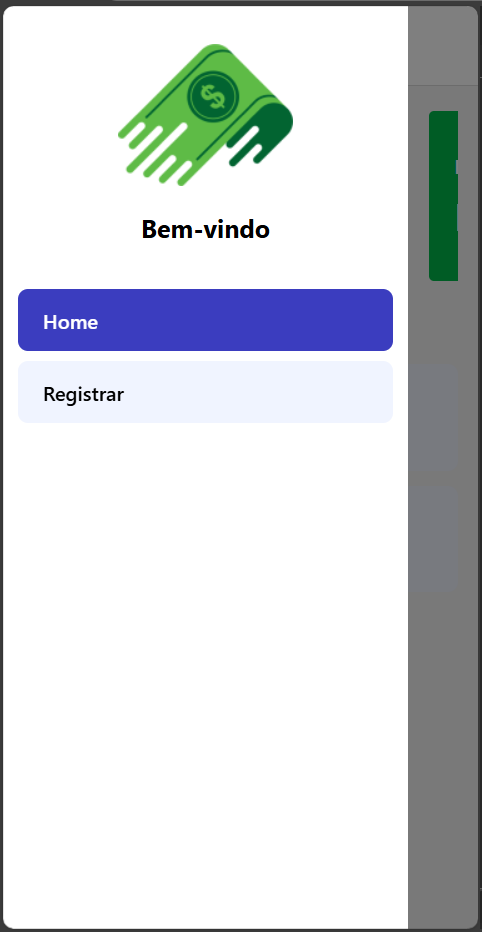

## 🖼️ Prints do sistema funcional

|        Tela de SignIn        |          Tela de SignUp          |          Tela Home           |
| :--------------------------: | :------------------------------: | :--------------------------: |
|  |  |  |

|         Tela Home 2          |           Tela Home 3            |         Tela de Registro         |
| :--------------------------: | :------------------------------: | :------------------------------: |
|  |  |  |

|      Drawer do sistema       |       Calendário para filtro       |
| :--------------------------: | :--------------------------------: |
|  |  |

## 🚀 Funcionalidades

- ✅ Autenticação de usuário (login/cadastro)
- ✅ Visualização de saldo atual, entradas e saídas do dia
- ✅ Registro de **receitas** e **despesas**
- ✅ Filtro de movimentações por data (calendário)
- ✅ Exclusão segura com confirmação
- ✅ Dados persistidos em backend REST

## 📦 Rodando o Projeto

- `npm install`
- `npm run web`

## 👥 Equipe

- Marcus Vinicius Silva Francisquini
- Alysson Bezerra de Oliveira

## 🔗 Links

- Backend: https://gitlab.com/DevRafaelSa/uniesp-financas-backend.git
- Figma: https://www.figma.com/design/JxABSe4TIhANXi3bVhngGw/Finan%C3%A7as-App?node-id=0-1&t=fwFkfVTqzfpufxNg-1
